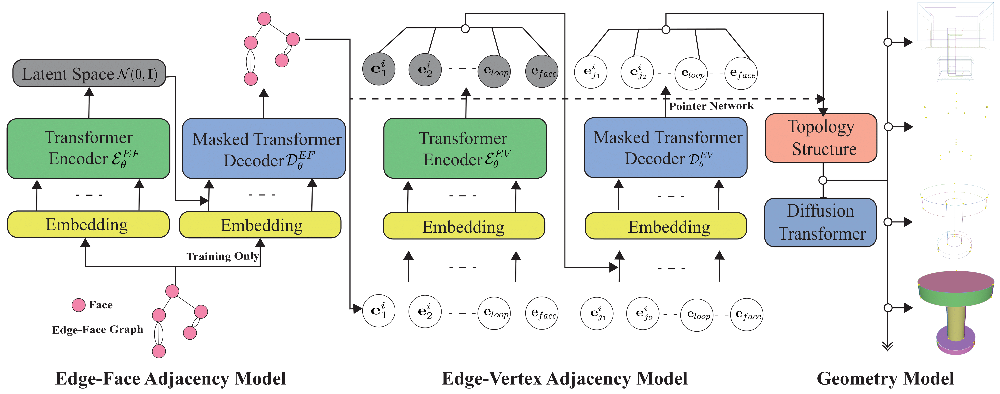

# DTGBrepGen: A Novel B-rep Generative Model through Decoupling Topology and Geometry (CVPR 2025)



### About
DTGBrepGen is a novel framework for automatically generating valid and high-quality Boundary Representation (B-rep) models, addressing the challenges posed by the complex interdependence between topology and geometry in CAD models. Unlike existing methods that prioritize geometric representation while neglecting topological constraints, DTGBrepGen explicitly models both aspects through a two-phase topology generation process followed by a Transformer-based diffusion model for geometry generation.

[[Project Page]](https://jinli99.github.io/DTGBrepGen/) | [[Paper]](https://arxiv.org/abs/2503.13110)

## Features
- 🏗 **Topology-Geometry Decoupling:** Separates topology and geometry generation, training them independently.  
- 🔄 **Two-Phase Topology Generation:** Uses Transformers to model **edge-face** and **edge-vertex** adjacencies separately.  
- 🎯 **B-spline Representations:** Learns **B-spline control points** for precise and compact geometric modeling.  
- 📊 **Strong Validity & Accuracy:** Ensures high **topological validity** and **geometric accuracy**, surpassing existing methods on CAD datasets.  


### Dependencies

To set up the environment and install dependencies, run:
```
conda create --name DTGBrepGen python=3.10.13 -y
conda activate DTGBrepGen

pip install torch==2.2.2 torchvision==0.17.2 torchaudio==2.2.2 --index-url https://download.pytorch.org/whl/cu121

pip install -r requirements.txt
pip install chamferdist
```

For OCCWL installation, follow the instructions [here](https://github.com/AutodeskAILab/occwl).

### Pre-trained Models
Download our pre-trained models from this [link](https://drive.google.com/file/d/1p_kgxpGI5a_ir-sLGh2HAMXpiBuoUod4/view?usp=drive_link).

### Dataset
You can download the datasets from the following sources:
- [ABC Dataset](https://archive.nyu.edu/handle/2451/43778)
- [DeepCAD dataaset](https://github.com/ChrisWu1997/DeepCAD) 

To preprocess the dataset, run:
```
python -m data_process.brep_process
```

### Training
To train the model, execute:
```
sh scripts/script.sh
```
This will train all models. To train specific models, comment out the corresponding lines in the script. We have tested the training on a system with 4 × NVIDIA A800 (80GB) GPUs, and each dataset takes approximately 3 days to train.

### Sampling
To generate B-rep models, run:
```
python -m inference.generate
```
Specify the name of the dataset in the main function to generate corresponding B-rep models.